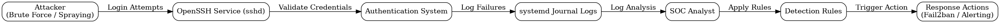

# SSH Brute Force & Username Spraying Detection Lab

## Overview

## SOC Incident Summary

This project simulates a real-world SSH brute-force and username spraying attack scenario in a controlled Linux environment.

The objective is to demonstrate how security telemetry (authentication logs) can be used to detect malicious activity and how automated defense mechanisms (Fail2ban) respond to repeated unauthorized access attempts.

The workflow follows a basic SOC detection lifecycle:
- Attack simulation
- Log generation
- Pattern detection
- Automated response
- Evidence documentation

## Incident Timeline

| Time | Event |
|------|------|
| T+0 | SSH brute-force attack simulated using repeated login attempts |
| T+1 | System logs generated authentication failures (`journalctl`) |
| T+2 | Repeated failed logins identified via log filtering |
| T+3 | Fail2ban detects threshold breach |
| T+4 | IP/user blocked automatically by Fail2ban |
| T+5 | Incident evidence collected and documented |

## Attack Flow Diagram

This diagram illustrates how SSH brute-force and username spraying attempts are processed from initial attack to detection and response within the system.

This project simulates and analyzes SSH-based attack patterns in a controlled Linux environment. It demonstrates how raw authentication logs can be used to identify brute force and username spraying activity, and how detection logic can be derived from observed behavior.

The goal is to replicate a basic SOC (Security Operations Center) workflow:
- Observe security events
- Analyze logs
- Identify attack patterns
- Develop detection logic

---

## Why This Project Matters

SSH brute force attacks are one of the most common threats targeting Linux servers. Understanding how these attacks appear in logs is a foundational SOC skill used in real-world monitoring, incident detection, and threat response.

This project demonstrates practical, hands-on understanding of:
- Linux log analysis
- Authentication event monitoring
- Basic detection engineering
- Attack pattern recognition

---

## Environment

- OS: Debian Linux (T480)
- Service: OpenSSH (sshd)
- Logging: systemd journal (`journalctl`)
- Setup: Local isolated lab environment

---

## What Was Simulated

### 1. Brute Force Attacks
Repeated login attempts against SSH using invalid credentials.

### 2. Username Spraying
Attempts using multiple common usernames to identify valid accounts.

### 3. Low-and-Slow Attempts
Distributed login attempts over time to simulate stealth behavior.

---

## Key Findings

- SSH logs clearly expose invalid login attempts and usernames
- Attack patterns can be identified through repetition and timing
- Both brute force and spraying behaviors are distinguishable in logs
- Localhost simulation behaves similarly to external attack patterns

---

## Detection Logic Developed

This project defines basic detection rules for:

- Repeated failed login attempts (brute force)
- Multiple usernames from same source (spraying)
- Persistent low-frequency authentication attempts (low-and-slow)

See `/detections/detection-rules.md` for full logic.

---

## MITRE ATT&CK Mapping

- T1110 – Brute Force
- T1110.003 – Password Spraying
- T1589 – Credential Access Techniques

---

## Skills Demonstrated

- Linux system administration
- SSH service monitoring
- Log analysis using `journalctl`
- Security event interpretation
- Basic SOC detection engineering
- Git-based workflow (CLI)

---

## Conclusion

This project demonstrates a full security detection and response lifecycle for SSH-based attacks in a Linux environment.

It shows practical ability in:
- Linux system monitoring
- Authentication log analysis
- Attack pattern recognition
- Automated defense configuration (Fail2ban)
- SOC-style incident documentation

This lab simulates foundational SOC analyst workflows used in real-world security operations centers.
